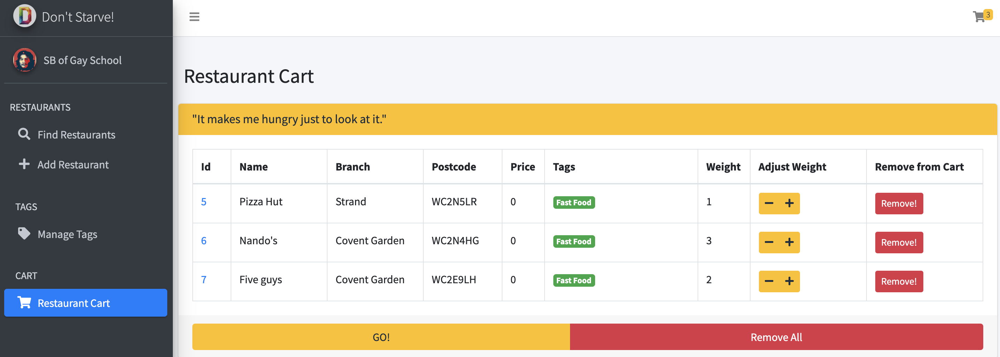

# KV1 - Don't Starve

Don't Starve is a small self-help platform where you can add your favorite restaurant in U.K.. When next time you wonder
where should you have dinner, you can make a weighted random selection on this platform, according to you preference.

## Deployment

- Clone the repository

```
git clone https://github.com/ComradeStukov/KV1
```

- Run the initialization script.

```
cd KV1
bash init.sh
```

- Config your database. If your are using MySQL, it may be convenient to use the provided template SQL script at
**database/create_database.sql**. 
- Modify the configuration for database at **database/config.py**, for server at **server/config.py** and for uwsgi at
**uwsgi/uwsgi.ini**.
- Generate database tables.

```
source venv/bin/activate
cd database
python3 initialize.py
cd ..
deactivate
```

- Optionally, if your are using Nginx as web server, you can modify the config file for Nginx as the following:

```
...
http {
    ...
    upstream KV1 {
        server unix:///path_to_kv1/uwsgi/uwsgi.sock;
        # server 127.0.0.1:1025;
    }
    ...
    server {
        ...
        # Location for KV1
        location /dont_starve/res/ {
            alias /path_to_kv1/server/webpage/res/;
        }
        location /dont_starve/ {
            uwsgi_pass  KV1;
            include     /path_to_kv1/uwsgi/uwsgi_params;
        }
        ...
    }
    ...
}
...
```

and modify your uwsgi config file **uwsgi/uwsgi.ini** as the following:

```
...
# module = main:app
mount = /dont_starve=main:app
...
```

- Start the uwsgi service with the config file.

```
/path_to_kv1/venv/bin/uwsgi -i /path_to_kv1/uwsgi/uwsgi.ini
```

## Usage

The web UI of the platform looks like the following (although there should be no restaurants at first).


You can add restaurant to the platform through clicking **RESTAURANTS - Add Restaurant** on the left slide bar.

When adding restaurant, the combination of name and branch of the restaurant must be unique. Also, please enter a
correct postcode, as it can later help the system to display the correct position of the restaurant on the map.

You can find added restaurant through **RESTAURANTS - Find Restaurants**, and can view their details by Clicking their ID.


Your are able to manage your restaurants by modifying their details or deleting them.

Also, you can manage your restaurant tags, including adding, modifying and deleting them, through
**TAGS - Manage Tags**.

When you don't know where to eat, just search for added restaurants and put those candidate to a "Restaurant cart".
You can view your restaurant cart by clicking the **cart icon** at the top right corner of the page. You can also use
**CART - Restaurant Cart** to manage your cart.



Weight of each restaurant in the cart can be adjusted. Restaurants with higher weight is more likely to be selected.
Also, restaurants in the cart will be kept until you close your browser.

When your cart is ready, click the **GO!** button at the bottom of **CART - Restaurant Cart**, and you will get your
weighted random selection result.


You can view the selected restaurant details by **THAT'S IT!** button, or make another choice by **AGAIN** button.

## Example

An example website can be found at [Don't Starve!](http://104.238.136.94/dont_starve/).

## Acknowledgement

- **License:** This program is published under [MIT License](LICENSE.txt).
- **Author:** SBofGaySchoolBuPaAnything *(Used Name: Eshttc_Cty, ComradeStukov)*
- **Contact:** Any bugs, issues, questions or suggestions please send to author's private email: 1532422769@qq.com,
or official college email: tc2819@ic.ac.uk, 15031211@buaa.edu.cn;
